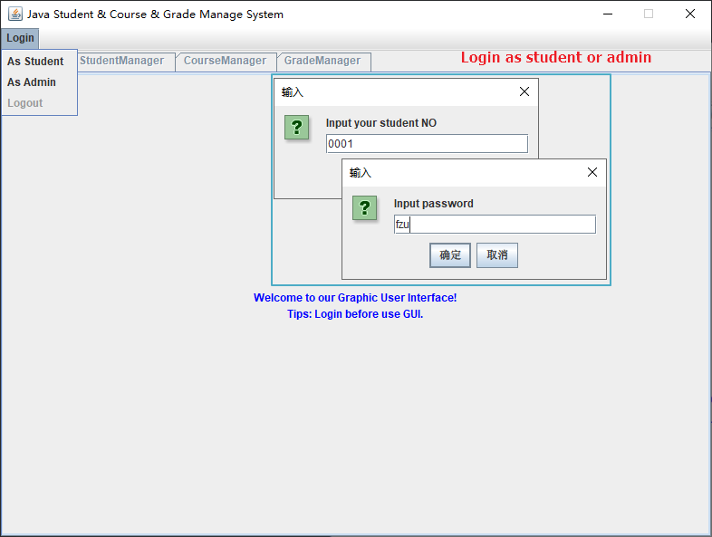
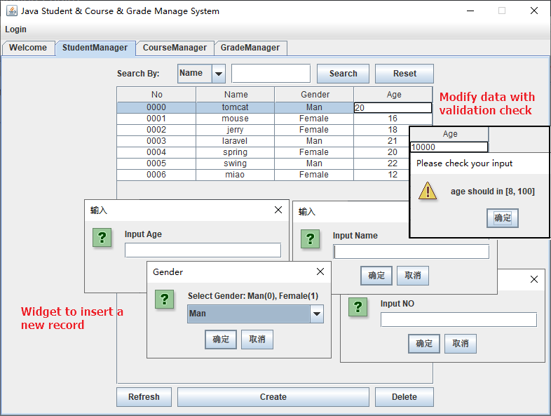
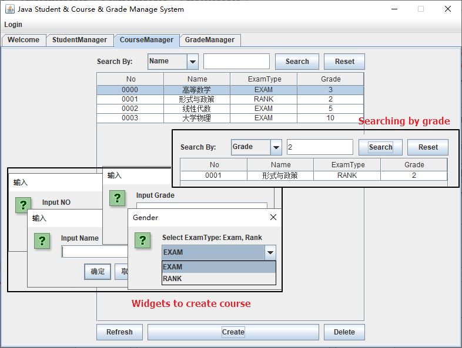
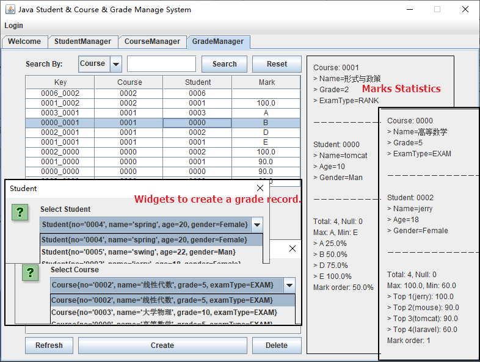
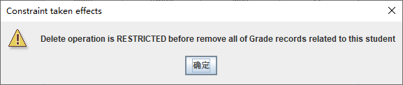

# GradeManageSystem

Java swing/CLI based simple grade manage system.

Features:

* Implements persistence layer framework with generic, reflection and serialization.
* Automatically generated cli actions and parse user inputs to specified methods that uses annotations and reflection.
* Lambda expressions used when create GUI.
* An expandable persistence implementation. Just implements the `DataPool` interface.
* A complete exception handler logic.
* A relational database models with constraint check and join operation implemented.

Good for Java Homework and Programming Exercises.

Screenshots

* Welcome Page(Including Login)

  

* StudentManager

  

* CourseManager

  

* GradeManager

  

* Constraint check when delete Student and Course

  

